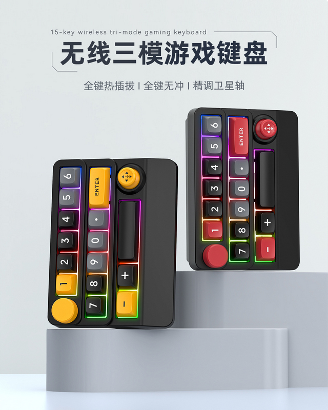

# MiniKeyboard2Mouse
一个AutoHotKey脚本，针对SXS-W909无线三模键盘，实现把键盘摇杆映射到鼠标，达到类似Thinkpad指控杆的效果。

## 问题的引出（针对劳菲希 MKESPN SXS-W909 三模客制化键盘）
- 官方的改键软件只能映射如下：
	1. 映射全键盘（108键）上的任意键位；
	2. 映射功能键（Fn + F1-12，调节音量、亮度、打开我的电脑、媒体中心等）；
	3. 绑定宏（可以录制键盘操作，变相实现组合键功能，即：ctrl/shift/alt + 键盘按键组合）。
- 但是，改建不能映射到鼠标，也就是说：
	1. 键盘的摇杆无法模拟鼠标方向移动；
	2. 键盘上的任意按键，无法映射到鼠标的左键和右键。

## 实现的效果
- 通过AutoHotKey脚本，把键盘上的摇杆映射到鼠标，最终把摇杆当成Thinkpad的小红点来使用；
- 主要的使用场景，客厅HTPC（Win10系统）连接电视，键盘蓝牙模式连接HTPC，沙发上使用键盘实现Win10系统的全部操作控制，从而方便看剧和刷B站视频。

## 具体使用方法
1. 先使用SXS-W909键盘自带的改键软件SXS-W909.exe（键盘官网www.mkespnhk.com下载），进行键盘硬件层的改键。我结合自己的需求设置如下：
	- 摇杆上 -> 改键为 W
	- 摇杆下 -> 改键为 S
	- 摇杆左 -> 改键为 A
	- 摇杆右 -> 改键为 D
	- 按键5  -> 改键为 M
	- 按键6  -> 改键为 N
	- 这里可以根据自己的实际需要修改，不是必须这样，只要在AHK脚本中也做相应的更改即可。
2. 目标电脑上安装AutoHotKey v2.0版本，然后双击脚本MiniKeyToMouseFix5.ahk运行即可，该脚本实现把摇杆（上下左右）映射到鼠标移动，按键5映射到鼠标左键，按键6键映射到鼠标右键；
	- 脚本代码的编写（如果想要修改代码）注意两点：
	- 一是，优化鼠标移动的加速和减速算法，以保证摇杆的手感稳定不发飘；
	- 二是，优化鼠标的移动角度矢量算法，以便让摇杆可以任意角度控制移动鼠标。
3. 设置为开机自启：
	- 文件管理器的地址栏输入 shell:startup，会打开 C:\Users\你的用户名\AppData\Roaming\Microsoft\Windows\Start Menu\Programs\Startup 文件夹；
	- 右键 MiniKeyToMouseFix5.ahk 脚本文件，选择 创建快捷方式；
	- 把快捷方式拖入启动文件夹；
	- 这样，每次开机都会自动运行该 AHK 脚本。
